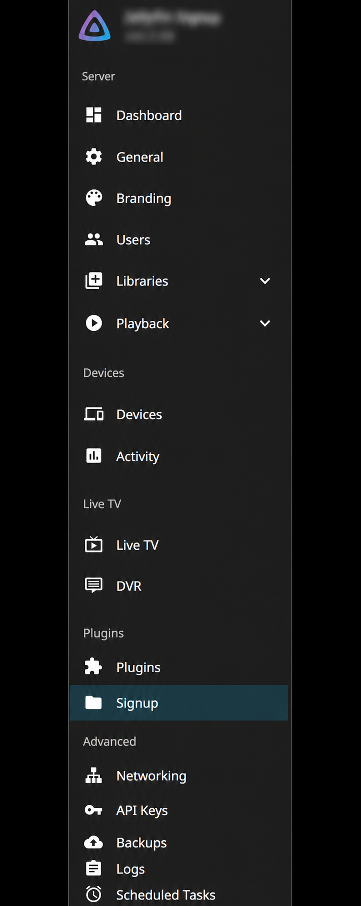
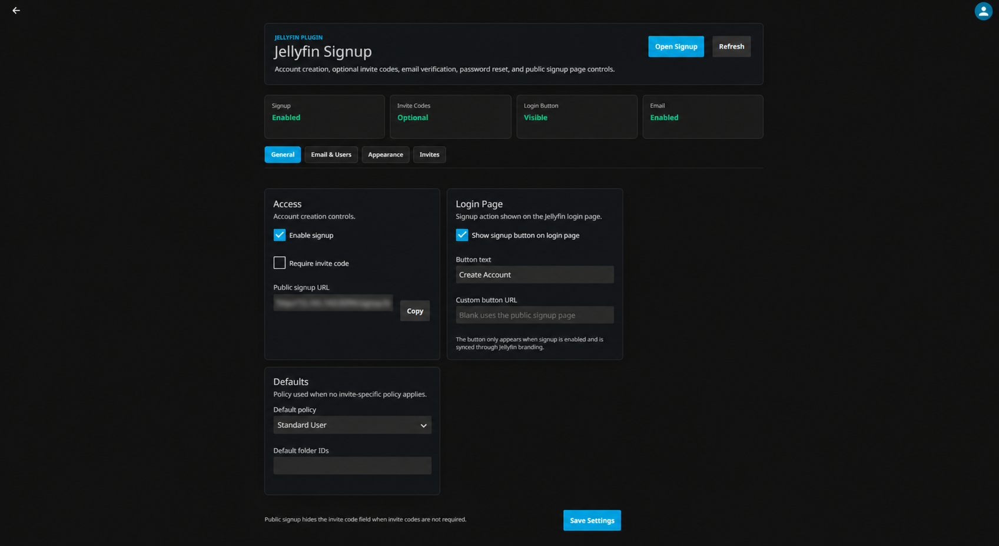
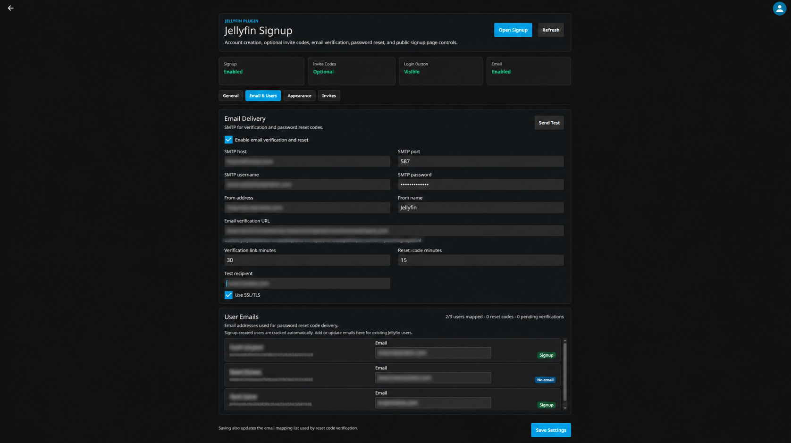
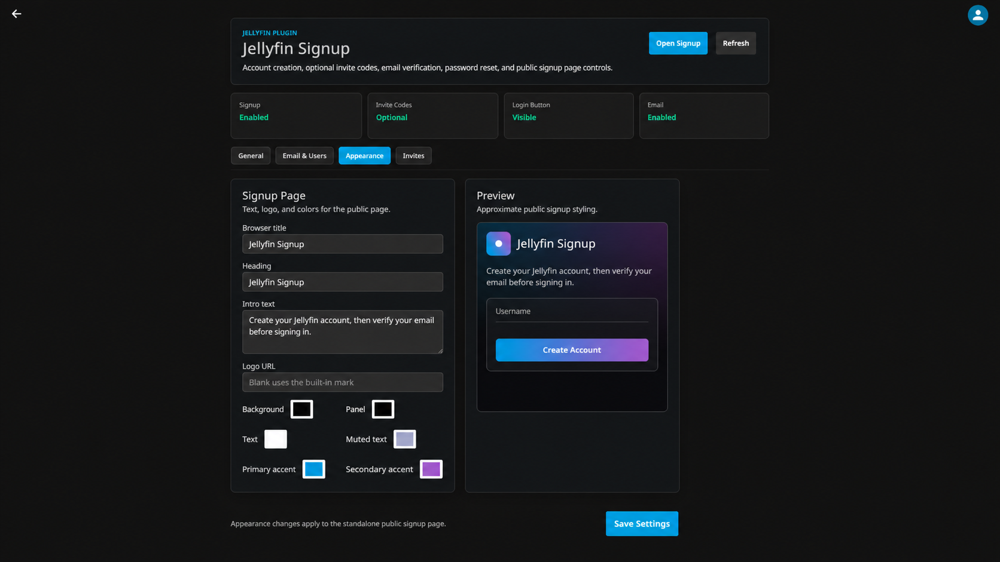
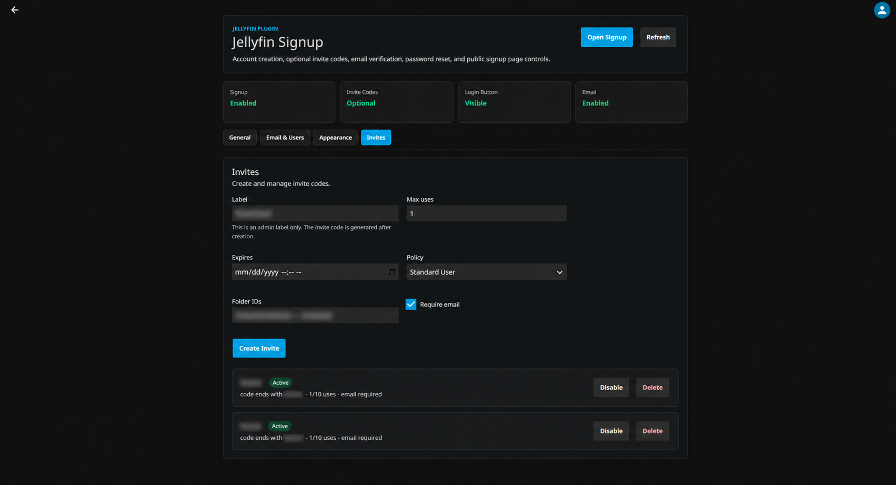

# Jellyfin Signup

Native signup and invite management for Jellyfin.

Jellyfin Signup adds a public account creation flow with optional invite codes, email verification, password reset support, and admin controls for how signup appears on the Jellyfin login page.

## Features

- Public signup page with configurable title, intro text, logo URL, and colors
- Optional invite code requirement
- Invite code creation with max uses, expiration, policy, folder IDs, and email requirement controls
- SMTP-backed email verification and password reset codes
- Email mapping for existing Jellyfin users
- Optional signup button on the Jellyfin login page

## Installation

Add this plugin repository to Jellyfin:

```text
https://raw.githubusercontent.com/Piglit09/jellyfin-plugin-signup-repo/main/manifest.json
```

Then install **Jellyfin Signup** from the Jellyfin plugin catalog and restart Jellyfin if prompted.

### Plugin Menu



### Public Signup Page


### General Settings



### Email And Users



### Appearance



### Invites



## Screenshots

The screenshots below are redacted to hide emails, usernames, URLs, invite codes, and server details.

## Release

Current release: `0.1.0`

Target Jellyfin ABI: `10.11.10.0`
